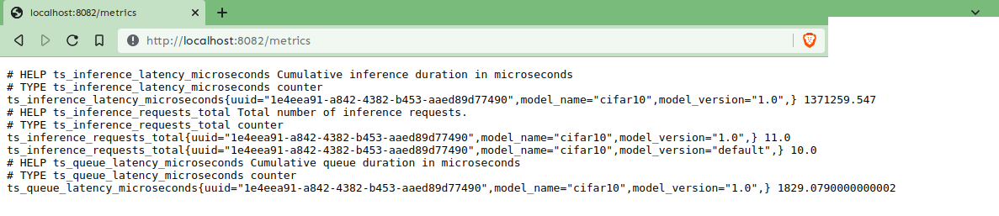

# EMLO Session 8


## Part 1 - 
Train resnet18 on CIFAR10 for 20 epochs and generate a scripted file. This was also done in session 4. The scripted file will be used.

To run torchserve, a docker image was built. This was optional in part 1, but a requirement in the bonus part.

```bash
docker build -t emlo2-s8:serve .
```

(This image is available at dockerhub via ainoob/emlo2-s8:serve)

To run torchserve container, simply execute

```bash
docker run -it --rm --net=host emlo2-s8:serve
```

On the host machine, inside the `testing_local`

```bash
pytest test_serve --ignore=test_serve/serve --disable-warnings
```

Note that the test scripts check for
- HTTP connection (for each of the 10 classes)
- gRPC connection (for each of the 10 classes)
- captum explanation for one class (checks for attribution and image size equality and generates the explanation image using NoiseTunnel)
- 
The `disable-warnings` is only used to suppress Matplotlib's warning and is unrelated to the code.


We can see the number of requests made (21: one far aptum, 10 for each http, 10 for each gRPC)



We can also see the tensorboard for the profiler


The profile couldn't be uploaded to tensorboard.dev. It just uploads an empty experiment.


## Part 2 - Bonus

Build the testing image. Inside the `testing_docker` folder, execute

```bash
docker build -t emlo2-s8:test .
```

(This image is available at dockerhub via ainoob/emlo2-s8:test)

However, we will run into problems while accessing the serving container. To fix this, we use a docker-compose .yml file to share the network.

```bash
docker compose up
```

See the running docker containers using `docker ps`. Look for the ID using the `emlo2-s8:test` image. drop into the shell.

```bash
docker exec -it 965b3dcd448a bash
```

Simply run
```bash
pytest test_serve --ignore=test_serve/serve --disable-warnings
```

The `disable-warnings` is only used to suppress Matplotlib's warning and is unrelated to the code.


Model could not be registered from S3 even while using http protocol (using static website hosting)

The only difference in the `testing_docker` and the `testing_local` folder is the different host address (serve in the former, which is coming from the docker-compose file and localhost in the latter) in the following files
- `/serve/ts_scripts/torchserve_grpc_client.py`
- `test_captum.py`
- `test_cifar10_grpc.py`
- `test_cifar10_http.py`


